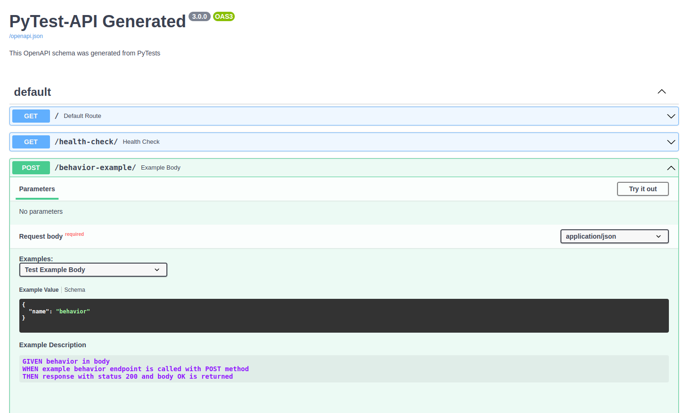

# PyTest-API: Populate OpenAPI Examples from Python Tests


PyTest-API is an [ASGI middleware](https://asgi.readthedocs.io/en/latest/specs/main.html#middleware) that populates [OpenAPI-Specification](https://github.com/OAI/OpenAPI-Specification/) examples from [pytest](https://pypi.org/project/pytest/) functions. 

## Installation

```shell
pip install pytest-api
```
or 
```
poetry add --dev pytest-api
```

## How to use it:

Starting with `test_main.py` file: 

```python
from .main import spec


@spec.describe
def test_default_route(client):
    """
    GIVEN
    WHEN root endpoint is called with GET method
    THEN response with status 200 and body OK is returned
    """
    response = client.get("/")
    assert response.status_code == 200
    assert response.json() == {"message": "OK"}
```

Impliment solution in `/main.py` file:

```python
from fastapi import FastAPI

from pytest_api import SpecificationMiddleware

app = FastAPI()
spec = SpecificationMiddleware

app.add_middleware(spec)

app.openapi = spec.custom_openapi


@app.get("/")
def default_route():
    return {"message": "OK"}
```

Run FastAPI app:
```bash
poetry run uvicorn test_app.main:app --reload
```

Open your browser to http://localhost:8000/docs#/ too find the doc string is populated into the description.

